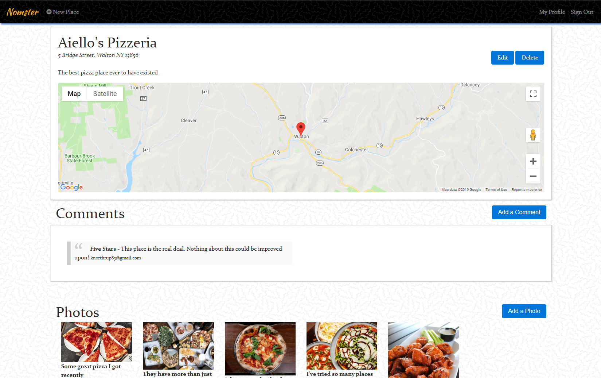

# Nomster

Nomster is a clone of _Yelp_ built using the Ruby on Rails framework. Users are able to sign up, create and edit location listings, and comment and rate all listings.
  
  
[View the deployed application](https://nomster-kevin-northrup.herokuapp.com/)
___

### Features:
- Built using Ruby on Rails
- Modals for location submissions
- Google Maps API to display location map
- Geocoder gem for geolocating
- Rails mailer sends email notifications of new comments
- Amazon Web Services (AWS) for photo storage
- Twitter Bootstrap3 for CSS and UI components
- PostgreSQL for database queries
- Devise gem for user authentication
- Simple Form gem for form generation
- CarrierWave gem for image uploading
- Kaminari for pagination
- User dashboard display user's submitted locations, comments, and other stats

___
### Screenshot:

